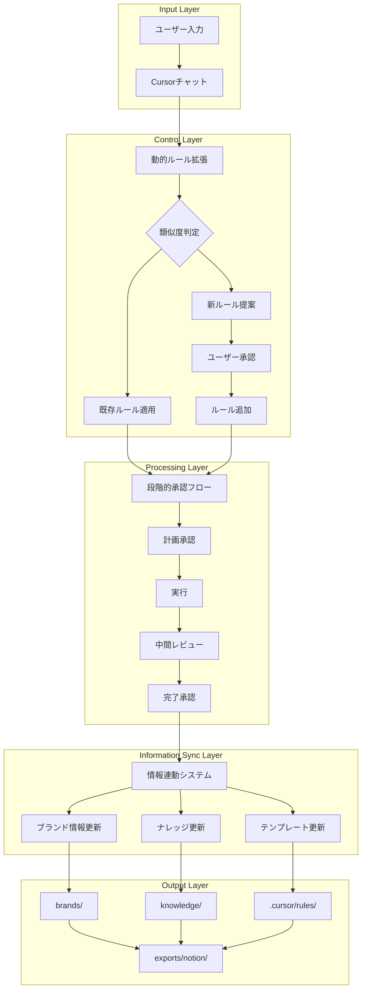
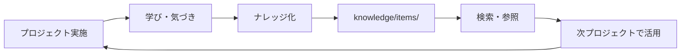

# マーケティング・コンサルティング特化 AIPMシステム v2.0 with Cursor Agent

## Marketing & Consulting Optimized AI-Powered Project Management System v2.0

マーケティング・コンサルティング業務に最適化された、次世代AIエージェント駆動型プロジェクト管理システム（改変版）

**対象読者**: マーケター / コンサルタント / ブランドマネージャー / クリエイティブディレクター ― 「戦略立案から実行、分析まで、多様なマーケティング業務を効率的に管理したい」すべての人へ

## 1. システム概要

本システムは、マーケティング・コンサルティング業務における幅広いタスクを一元管理し、AIエージェントの支援により生産性を飛躍的に向上させるために設計されました。

### 主な特徴（v2.0改変版）

- **情報連動型アーキテクチャ**: プロジェクト・ブランド・ナレッジが双方向で連動
- **段階的承認システム**: 各段階でユーザー確認を取りながら進行
- **動的ルール拡張システム**: 類似度ベースで新しいトリガーワードを自動提案
- **統一プロジェクト構造**: プロジェクトごとに一貫したフォルダ構造
- **自動ブランド情報更新**: 調査結果やプロジェクト完了時に自動更新
- **Notion連携**: ページ形式での自動出力
- **レビューフレキシビリティ**: 必須/任意の柔軟な設定
- **ワンコマンドセットアップ**: 「初期設定をお願いします」だけで全環境構築

### 成し遂げたいこと（v2.0改変版）

1. **情報の連動性確保**: プロジェクト情報とブランド情報の自動同期
2. **ルール拡張の自動化**: 新しい業務でもルールを自動更新しながら遂行
3. **ワークフローの明確化**: 初回業務でも手順に再現性を確保
4. **ドキュメント化の統一**: マークダウン形式での一貫した文書管理
5. **Notion連携**: 作成したドキュメントをNotionに自動出力
6. **フォルダ構造の安定性**: プロジェクトごとに一貫した構造
7. **ブランド情報の自動更新**: 調査結果を自動でブランド情報に反映
8. **柔軟なレビュープロセス**: 必須/任意の使い分けが可能
9. **トリガーワード管理**: 未知のワードでも類似度ベースで適切に処理
10. **ユーザー確認の徹底**: 各段階で必ず確認を取りながら進行

## 2. システム全体像（v2.0改変版）



### 主要コンセプト

#### 6レイヤーモデル

| レイヤー | 役割 | 主な成果物 | トリガー例 |
|---------|------|-----------|-----------|
| **L1: Strategy** | 戦略立案・市場分析 | ブランド戦略、価格戦略、市場分析レポート | 「戦略」「価格設定」「市場分析」 |
| **L2: Planning** | 企画・設計 | キャンペーン企画、メディアプラン、コンテンツカレンダー | 「キャンペーン」「メディアプラン」 |
| **L3: Creative** | 制作・クリエイティブ | デザイン、記事、動画、LP | 「記事作成」「デザイン」「コピー」 |
| **L4: Execution** | 実行・運用 | 広告運用、SNS投稿、イベント実施 | 「広告運用」「SNS」「実行」 |
| **L5: Analytics** | 分析・改善 | 効果測定レポート、ROI分析、インサイト | 「効果測定」「分析」「ROI」 |
| **L6: Knowledge** | ナレッジ管理 | ケーススタディ、ベストプラクティス、フレームワーク | 「ナレッジ」「事例」 |

#### 2トラック管理システム

| トラック | 特徴 | 用途例 | 管理場所 |
|---------|------|--------|---------|
| **Projects** | 単発・期限あり・成果物明確 | 新商品LP制作、ブランド戦略策定 | workspace/projects/ |
| **Operations** | 継続・定期実行・改善型 | 月次レポート、広告運用、SNS運用 | workspace/operations/ |

#### ワークフローパイプライン

```
入力 → 分類 → 処理 → レビュー → 保存 → 共有 → ナレッジ化
```

## 3. 基本的なフォルダ構造（v2.0改変版）

```
プロジェクトルート/
├── .cursor/                      # ⚙️ システム設定
│   └── rules/                  # ルールファイル
│       ├── basic/              # 基本ルール
│       │   ├── 00_master_rules.mdc
│       │   ├── 01_paths.mdc
│       │   ├── 02_approval_flow.mdc
│       │   └── 03_dynamic_rules.mdc
│       ├── marketing/          # マーケティング特化ルール
│       │   ├── 10_strategy.mdc 
│       │   ├── 11_planning.mdc 
│       │   ├── 12_creative.mdc
│       │   ├── 13_execution.mdc
│       │   ├── 14_analytics.mdc
│       │   └── 15_knowledge.mdc
│       └── workflows/          # ワークフロー定義
│           ├── 20_project_flow.mdc
│           ├── 21_brand_update.mdc
│           └── 22_notion_export.mdc
│
├── .system/                      # 🔧 システム管理
│   ├── templates/              # システムテンプレート
│   └── config/                 # 設定ファイル
│
├── brands/                       # 🏢 ブランド管理（連動型）
│   ├── _template/               # テンプレート
│   │   ├── profile.yaml        
│   │   ├── knowledge/          
│   │   └── projects/           
│   └── BrandA/                  # 実際のブランド
│       ├── profile.yaml         # 基本情報
│       ├── knowledge/           # ブランド固有ナレッジ
│       └── projects/            # プロジェクト履歴
│
├── projects/                     # 📁 統一プロジェクト構造
│   └── 2024-01-20_strategy_BrandA/
│       ├── 01_planning/         # 計画段階
│       ├── 02_execution/        # 実行段階
│       ├── 03_review/           # レビュー段階
│       └── 04_completion/       # 完了段階
│
├── knowledge/                    # 📚 グローバルナレッジ
│   ├── _index.yaml             # 検索インデックス
│   ├── items/                  # 個別ナレッジ
│   │   ├── k0001_seo_best_practice.md
│   │   └── k0002_pricing_framework.md
│   └── templates/              # テンプレート集
│       ├── article.md          
│       ├── strategy.md         
│       └── report.md           
│
├── exports/                      # 📤 出力管理
│   ├── notion/                 # Notion出力
│   │   └── pages/              # ページ形式
│   └── documents/              # 一般ドキュメント
│       ├── reports/            # レポート
│       ├── guidelines/         # ガイドライン
│       └── presentations/      # プレゼン
│
├── scripts/                      # 🔧 管理スクリプト
│   ├── init_brand.py           
│   ├── manage_knowledge.py     
│   ├── sync_brand_info.py      # ブランド情報同期
│   └── export_to_notion.py     # Notion出力
│
└── _backup/                      # 💾 バックアップ
```

## 4. システムのセットアップ

### クイックスタート（推奨）

Cursorの新規ウィンドウから3ステップで完全セットアップ：

1. **Cursorを起動**し、「New Window」を選択
2. **「Clone repo」**を選び、このリポジトリのURLを入力
   
   https://github.com/[your-username]/marketing-aipm
   
3. フォルダ指定のUIが表示されたら、右下の**「Select as repository destination」**をクリック
4. リポジトリがクローンされたら、**README.md**ファイルを開く
5. Chatパネルを開き**「初期設定お願いします」**と入力

これだけで、READMEの内容を読み取り、必要な初期設定が自動的に実行されます。

### 手動セットアップ

```bash
# リポジトリをクローン
git clone https://github.com/[your-username]/marketing-aipm.git
cd marketing-aipm

# セットアップスクリプトを実行
chmod +x setup_workspace.sh
./setup_workspace.sh

# カスタム設定を使用する場合
./setup_workspace.sh setup_config.sh
```

### セットアップスクリプトの動作

`setup_workspace.sh`は以下を自動実行：

1. **ディレクトリ構造の作成**
   - workspace/, brands/, knowledge/, exports/など全フォルダ
   - 適切な権限設定

2. **ルールファイルの生成**（.cursor/rules/）
   - マスタールール（制御系）
   - 6レイヤールール（L1-L6）
   - パス定義ファイル

3. **テンプレートの配置**（knowledge/templates/）
   - 記事テンプレート
   - 戦略フレームワーク
   - レポートフォーマット
   - 分析テンプレート

4. **管理スクリプトの生成**（scripts/）
   - ブランド初期化（init_brand.py）
   - プロジェクト管理（manage_project.py）
   - ナレッジ管理（manage_knowledge.py）
   - レポート生成（generate_report.py）

5. **初期設定ファイルの作成**
   - ブランドテンプレート
   - ナレッジインデックス
   - VSCode設定

### セットアップのカスタマイズ

`setup_config.sh`を編集してカスタマイズ：

```bash
# 自動承認（確認スキップ）
AUTO_APPROVE=false

# 初期ブランド設定
INITIAL_BRANDS=("BrandA" "BrandB" "BrandC")

# カテゴリ設定
DEFAULT_CATEGORIES="strategy,creative,content,analysis,operations"

# バックアップ設定
ENABLE_BACKUP=true
BACKUP_INTERVAL="daily"  # daily/weekly/monthly

# 言語設定
TEMPLATE_LANG="ja"  # ja/en
```

### User Rules設定（必須）

Cursorの設定でUser Rulesを追加してください：

1. Cursorの右上にある**歯車アイコン（⚙️）**をクリック
2. **「Settings」**から**「Rules」**を選択
3. 以下の内容をコピーして貼り付け：

```yaml
========================================================
 マーケティングAIPMシステム用設定
========================================================
! Always respond in 日本語
- READMEがある場合は必ず最初に読み込む
- 初期設定リクエストではsetup_workspace.shを実行
- 添付されてるRulesがないか確認し、あったら必ず読み込む
- 成果物はできるだけファイルとして生成（edit_file使用）
- タスク依頼時は不足情報を確認し、自ら計画→ゴールまで進行

========================================================
 必須ルールファイル参照
========================================================
required_rule_files:
  - .cursor/rules/core/00_master_rules.mdc
  - .cursor/rules/core/paths.mdc
```

## 5. レイヤー別の使い方

### L1️⃣ 戦略レイヤー（Strategy）

**ブランド戦略立案**
```
User: ブランド戦略を作りたい
AI: ブランド戦略の作成を開始します。以下の情報を教えてください：
    1. ブランド名：
    2. ターゲット市場：
    3. 競合優位性：
    [質問に回答すると戦略ドキュメントを自動生成]
```

**価格戦略**
```
User: 価格戦略
AI: 価格設定フレームワークを適用します...
    → workspace/projects/active/2024-01-20_BrandA_pricing/
```

**市場分析**
```
User: 市場分析レポート作って
AI: 市場分析テンプレートを使用します...
```

### L2️⃣ 企画レイヤー（Planning）

**キャンペーン企画**
```
User: キャンペーン企画
AI: キャンペーンの種類を選択してください：
    1. 新商品ローンチ
    2. ブランド認知向上
    3. 季節キャンペーン
    4. その他
```

**メディアプラン**
```
User: メディアプラン作成
AI: メディアプランニングシートを準備します...
```

### L3️⃣ 制作レイヤー（Creative）

**SEO記事作成**
```
User: SEO記事書きたい
AI: SEO記事の作成を開始します。
    テーマ：[入力]
    ターゲットキーワード：[入力]
    文字数：[選択]
```

**デザインブリーフ**
```
User: デザイン指示書
AI: デザインブリーフを作成します...
```

**コピーライティング**
```
User: キャッチコピー作成
AI: コピー開発ワークシートを使用します...
```

### L4️⃣ 実行レイヤー（Execution）

**広告運用**
```
User: 広告運用開始
AI: 広告運用の設定を行います：
    プラットフォーム：[Google/Facebook/Instagram]
    予算：[日額/月額]
    → workspace/operations/BrandA/ads/
```

**SNS運用**
```
User: SNS投稿計画
AI: SNSコンテンツカレンダーを作成します...
```

### L5️⃣ 分析レイヤー（Analytics）

**効果測定**
```
User: 効果測定したい
AI: 測定対象を選択してください：
    1. キャンペーン効果
    2. 広告パフォーマンス
    3. コンテンツエンゲージメント
```

**月次レポート**
```
User: 月次レポート作成
AI: 月次レポートを生成します...
    → workspace/operations/BrandA/reports/2024-01/
```

**ROI分析**
```
User: ROI分析
AI: ROI計算シートを準備します...
```

### L6️⃣ ナレッジレイヤー（Knowledge）

**ナレッジ追加**
```
User: ナレッジ追加
AI: ナレッジの登録を行います：
    タイトル：[入力]
    カテゴリ：[選択]
    タグ：[入力]
    → knowledge/items/k0003_new_insight.md
```

**ナレッジ検索**
```
User: SEOのベストプラクティス探して
AI: ナレッジベースを検索中...
    見つかりました：
    - k0001_seo_best_practice.md
    - k0015_seo_2024_trends.md
```

**ケーススタディ**
```
User: 成功事例をまとめたい
AI: ケーススタディテンプレートを使用します...
```

## 6. 全トリガーワード対応表

### プロジェクト管理系

| トリガーワード | 説明 | 出力先 | 必要情報 |
|--------------|------|-------|---------|
| 新規プロジェクト、プロジェクト開始 | 新規プロジェクト作成 | workspace/projects/active/ | プロジェクト名、タイプ、期限 |
| ブランド追加、new brand | ブランド初期化 | brands/{brand_name}/ | ブランド名、カテゴリ |
| タスク確認、todo | 進行中タスク表示 | - | - |
| 完了、done | タスク完了処理 | workspace/projects/done/ | 対象タスク |
| 継続更新 | 継続タスク更新 | workspace/operations/ | 対象タスク |

### L1: 戦略系

| トリガーワード | 説明 | 出力先 | 必要情報 |
|--------------|------|-------|---------|
| 戦略、strategy、ブランド戦略 | ブランド戦略立案 | projects/active/ | ブランド名、ビジョン、ターゲット |
| 価格戦略、pricing、価格設定 | 価格戦略策定 | projects/active/ | 商品、競合価格、コスト |
| 市場分析、market analysis | 市場分析レポート | projects/active/ | 対象市場、競合 |
| ポジショニング | ポジショニングマップ | projects/active/ | 軸、競合 |
| SWOT分析 | SWOT分析 | projects/active/ | 内部・外部要因 |

### L2: 企画系

| トリガーワード | 説明 | 出力先 | 必要情報 |
|--------------|------|-------|---------|
| キャンペーン、campaign、施策 | キャンペーン企画 | projects/active/ | 目的、予算、期間 |
| メディアプラン、media plan | メディア戦略 | projects/active/ | 予算、ターゲット |
| コンテンツ戦略、content strategy | コンテンツ計画 | projects/active/ | チャネル、頻度 |
| イベント企画、event | イベント計画 | projects/active/ | 規模、予算、日程 |
| プロモーション | プロモーション企画 | projects/active/ | 商品、ターゲット |

### L3: 制作系

| トリガーワード | 説明 | 出力先 | 必要情報 |
|--------------|------|-------|---------|
| 記事、article、SEO記事、ブログ | 記事作成 | projects/active/ | テーマ、キーワード、文字数 |
| デザイン、design、クリエイティブ | デザイン制作 | projects/active/ | 用途、サイズ、トンマナ |
| コピー、copy、キャッチコピー | コピーライティング | projects/active/ | 商品、ターゲット、トーン |
| LP、ランディングページ | LP制作 | projects/active/ | 目的、構成、CTA |
| 動画、video | 動画企画 | projects/active/ | 長さ、用途、予算 |

### L4: 実行系

| トリガーワード | 説明 | 出力先 | 必要情報 |
|--------------|------|-------|---------|
| 広告運用、ads、広告 | 広告運用管理 | operations/{brand}/ads/ | 媒体、予算、期間 |
| SNS、social、SNS運用 | SNS運用 | operations/{brand}/sns/ | チャネル、頻度 |
| メール配信、email | メール配信 | operations/{brand}/email/ | リスト、内容 |
| 実行、execution、実施 | 施策実行 | projects/active/ | 実行計画 |
| リリース、launch | リリース管理 | projects/active/ | リリース日、内容 |

### L5: 分析系

| トリガーワード | 説明 | 出力先 | 必要情報 |
|--------------|------|-------|---------|
| 効果測定、分析、analytics | 効果分析 | projects/active/ | 対象、期間、KPI |
| 月次レポート、monthly report | 定期レポート | operations/{brand}/reports/ | 期間、項目 |
| ROI、roi、投資対効果 | ROI分析 | projects/active/ | 投資額、収益 |
| ダッシュボード、dashboard | ダッシュボード作成 | exports/reports/ | 指標、更新頻度 |
| インサイト、insight | インサイト抽出 | knowledge/items/ | データソース |

### L6: ナレッジ系

| トリガーワード | 説明 | 出力先 | 必要情報 |
|--------------|------|-------|---------|
| ナレッジ追加、knowledge | 知見登録 | knowledge/items/ | タイトル、内容、タグ |
| ナレッジ検索、search | 知見検索 | - | 検索キーワード |
| ケーススタディ、case study | 事例作成 | knowledge/items/ | プロジェクト、成果 |
| ベストプラクティス、best practice | ノウハウ文書化 | knowledge/items/ | 分野、内容 |
| テンプレート追加 | テンプレート登録 | knowledge/templates/ | 用途、形式 |

### システム管理系

| トリガーワード | 説明 | 出力先 | 必要情報 |
|--------------|------|-------|---------|
| バックアップ、backup | バックアップ実行 | _backup/ | 対象 |
| エクスポート、export | 外部出力 | exports/ | 形式、対象 |
| レポート出力 | レポート生成 | exports/reports/ | 期間、形式 |
| 設定確認、config | 設定表示 | - | - |
| ヘルプ、help | ヘルプ表示 | - | - |

## 7. ユースケース：新商品ローンチプロジェクト

実際のプロジェクト例として「新商品ローンチ」の流れを示します。

### Phase 1: 戦略策定

**プロジェクト開始**
```
User: 新規プロジェクト
AI: プロジェクトタイプを選択してください：
User: 1（戦略策定）
AI: プロジェクト名を入力してください：
User: ProductX ローンチ戦略
AI: 以下のディレクトリを作成しました：
    workspace/projects/active/2024-01-20_ProductX_launch/
```

**市場分析**
```
User: 市場分析
AI: ProductXの市場分析を開始します。
    ターゲット市場：若年層（20-35歳）
    市場規模：約500億円
    主要競合：A社、B社、C社
    → market_analysis.md を作成しました
```

### Phase 2: キャンペーン企画

**キャンペーン企画**
```
User: キャンペーン企画
AI: ローンチキャンペーンの企画を作成します。
    【企画概要】
    - キャンペーン名：ProductX デビューキャンペーン
    - 期間：2024年2月1日〜28日
    - 予算：1,000万円
    - KPI：認知率20%向上、初月売上1億円
    → campaign_plan.md を作成しました
```

### Phase 3: クリエイティブ制作

**LP作成**
```
User: LP作成
AI: ProductXのLPを設計します。
    【構成】
    1. ヒーローセクション（キャッチコピー＋ビジュアル）
    2. 商品特徴（3つのポイント）
    3. ユーザーボイス
    4. 価格・購入CTA
    → lp_wireframe.md を作成しました
```

**キャッチコピー**
```
User: キャッチコピー
AI: ProductXのキャッチコピー案：
    メイン：「毎日に、新しい驚きを。」
    サブ：「ProductXが変える、あなたの日常」
    → copy_variations.md を作成しました
```

### Phase 4: 実行

**広告運用開始**
```
User: 広告運用開始
AI: ProductXの広告運用を設定します。
    【Google Ads】
    - 日予算：10万円
    - ターゲティング：20-35歳、興味関心
    - 広告文：作成済みコピーを使用
    → workspace/operations/ProductX/ads/google/設定完了
```

**SNS投稿計画**
```
User: SNS投稿計画
AI: 2月のSNS投稿カレンダーを作成しました。
    - 投稿頻度：週3回
    - コンテンツmix：商品紹介40%、How-to 30%、UGC 30%
    → workspace/operations/ProductX/sns/calendar.md
```

### Phase 5: 分析・改善

**週次レポート**
```
User: 週次レポート
AI: 第1週のパフォーマンスレポート：
    【結果サマリー】
    - インプレッション：150万
    - CTR：2.3%（目標2.0%）✅
    - CV：523件
    - CPA：8,500円（目標10,000円以下）✅
    
    【改善提案】
    - 高パフォーマンス広告の予算増額
    - 低CTRクリエイティブの差し替え
    → weekly_report_w1.md を作成しました
```

### Phase 6: ナレッジ化

**ケーススタディ作成**
```
User: ケーススタディ作成
AI: ProductXローンチの成功事例をまとめます。
    【プロジェクト概要】
    - 期間：1ヶ月
    - 予算：1,000万円
    - 成果：初月売上1.5億円（目標比150%）
    
    【成功要因】
    1. ターゲットインサイトの的確な把握
    2. クリエイティブA/Bテストの継続実施
    3. リアルタイムでの運用最適化
    
    【学び・今後への応用】
    - 初週のデータで早期最適化が重要
    - SNSとの連携でCPAを20%削減可能
    → knowledge/items/k0025_productx_launch.md
```

## 8. プロジェクト管理

### プロジェクトタイプ

```yaml
単発プロジェクト:
  特徴:
    - 明確な開始と終了
    - 具体的な成果物
    - 期限設定あり
  例:
    - 新商品ローンチ
    - リブランディング
    - Webサイトリニューアル
  管理:
    workspace/projects/active/ → done/

継続運用:
  特徴:
    - 定期的・反復的
    - 継続的改善
    - 期限なし
  例:
    - 月次レポート作成
    - SNS日常運用
    - 広告運用管理
  管理:
    workspace/operations/{brand}/{task}/
```


### ステータス管理

```yaml
ステータス:
  planning: 企画中
  in_progress: 実行中
  review: レビュー中
  completed: 完了
  on_hold: 保留
  cancelled: 中止
```


### プロジェクトメタデータ

```yaml
project:
  id: "PRJ-2024-001"
  name: "ProductX Launch"
  brand: "BrandA"
  type: "campaign"
  status: "in_progress"
  priority: "high"
  created: "2024-01-20"
  deadline: "2024-02-28"
  budget: 10000000
  owner: "marketing_team"
  kpis:
    awareness: 20
    sales: 100000000
  tags: ["launch", "q1", "priority"]
```


## 9. ナレッジ管理システム

### ナレッジの分類

```yaml
カテゴリ:
  strategy:     # 戦略・フレームワーク
  creative:     # クリエイティブ・デザイン
  content:      # コンテンツ・SEO
  analysis:     # 分析・レポート
  operations:   # 運用・実行

タグ例:
  - #seo
  - #branding
  - #socialmedia
  - #automation
  - #bestpractice
  - #casestudy
  - #framework
  - #template
```


### ナレッジ検索

**キーワード検索**
```
User: SEOの記事作成Tips
AI: 関連ナレッジが3件見つかりました：
    1. k0001_seo_best_practice.md
    2. k0015_content_optimization.md
    3. k0023_keyword_research.md
```

**カテゴリ検索**
```
User: strategy カテゴリのナレッジ
AI: 戦略カテゴリのナレッジ一覧：
    - k0002_pricing_framework.md
    - k0008_brand_positioning.md
    - k0012_market_entry.md
```

**タグ検索**
```
User: #bestpractice タグ
AI: ベストプラクティス一覧：
    - k0001_seo_best_practice.md
    - k0009_ad_optimization.md
    - k0016_email_marketing.md
```

### ナレッジ活用フロー




## 10. よくある質問（FAQ）

### システム利用について

**Q1: トリガーワードが反応しない場合は？**

A1: 以下を確認してください：
1. ルールファイルが正しく生成されているか確認
   
   ```bash
   ls -la .cursor/rules/core/
   ls -la .cursor/rules/marketing/
   ```
   
2. User Rulesが設定されているか確認
3. 明示的にルールをメンション
   
   ```
   @.cursor/rules/core/00_master_rules.mdc
   ```
   
4. それでも動かない場合は、setup_workspace.shを再実行

**Q2: ファイルはどこに作成される？**

A2: 用途により異なります：
- 作業中 → `workspace/projects/active/`
- 継続タスク → `workspace/operations/{brand}/`
- 完了 → `workspace/projects/done/`
- ナレッジ → `knowledge/items/`
- 共有用 → `exports/`

**Q3: 複数ブランドを管理できる？**

A3: はい、可能です。ブランドごとに独立したディレクトリで管理：

```
brands/BrandA/
brands/BrandB/
brands/BrandC/
```


**Q4: チームで共有するには？**

A4: GitHubでの共有を推奨：
1. brandsとknowledgeをコミット
2. workspaceは.gitignoreで除外
3. exportsで成果物を共有

**Q5: バックアップは？**

A5: 以下の方法で実施：

```bash
# 手動バックアップ
User: バックアップ

# 自動バックアップ（setup_config.shで設定）
ENABLE_BACKUP=true
BACKUP_INTERVAL="daily"
```


### トラブルシューティング

**エラー: Permission denied**

```bash
chmod +x setup_workspace.sh
chmod +x scripts/*.py
```

**エラー: Python module not found**

```bash
pip install -r requirements.txt
# または
pip install PyYAML python-dateutil
```

**エラー: ディレクトリが見つからない**

```bash
# ディレクトリ構造を再作成
./setup_workspace.sh
```


### カスタマイズ

**新しいテンプレートを追加したい**
1. `knowledge/templates/`に配置
2. ルールファイルにトリガー追加
3. マスタールールに登録

**新しいカテゴリを追加したい**
1. `knowledge/_index.yaml`を編集
2. カテゴリ追加
```yaml
categories:
  - strategy
  - creative
  - new_category  # 追加
```


**独自のワークフローを作りたい**
1. `.cursor/rules/marketing/`に新規ルール作成
2. マスタールールにトリガー登録
3. テンプレート作成

## 11. ベストプラクティス

### 効率的な活用方法

1. **テンプレート活用**
   - 頻出タスクは必ずテンプレート化
   - カスタマイズして再利用

2. **ナレッジの即時記録**
   - プロジェクト完了時に必ず記録
   - 小さな気づきも蓄積

3. **定期レビュー**
   - 週次でタスク棚卸し
   - 月次でナレッジ整理

### プロジェクト管理のコツ

1. **明確な分類**
   - 単発と継続を明確に分離
   - ブランドごとに整理

2. **メタデータ活用**
   - タグを積極的に付与
   - 検索性を意識

3. **定期的なアーカイブ**
   - 完了プロジェクトは速やかにdone/へ
   - 重要な成果物はknowledge/へ

### チーム連携

1. **役割分担**
   - ブランドオーナー制
   - レビュープロセス明確化

2. **情報共有**
   - exports/を活用
   - 定期的な共有会

3. **標準化**
   - 命名規則の統一
   - プロセスの文書化

## 12. システム拡張

### ルール追加方法

```bash
# 新規ルール作成
User: 新しいルールを追加したい

# 1. ルールファイル作成
touch .cursor/rules/marketing/16_new_feature.mdc

# 2. マスタールールに登録
# 00_master_rules.mdcに追記

# 3. テスト
User: [新しいトリガーワード]
```


### 外部連携

```yaml
連携可能サービス:
  - GitHub: バージョン管理
  - Slack: 通知連携
  - Google Drive: ファイル共有
  - Notion: ドキュメント管理
  - Figma: デザイン連携
```


### APIとの連携（将来拡張）

```python
# 例：ChatGPT API連携
import openai

def generate_content(prompt):
    response = openai.ChatCompletion.create(
        model="gpt-4",
        messages=[{"role": "user", "content": prompt}]
    )
    return response.choices[0].message.content
```


## 13. 開発ロードマップ

### Version 1.0（現在）
- ✅ 6レイヤー構造
- ✅ ブランド管理
- ✅ ナレッジシステム
- ✅ 基本的な自動化

### Version 1.1（計画中）
- ⬜ ダッシュボード機能
- ⬜ レポート自動生成
- ⬜ 外部API連携
- ⬜ モバイル対応

### Version 2.0（構想）
- ⬜ AI学習機能
- ⬜ 予測分析
- ⬜ 自動最適化
- ⬜ マルチ言語対応

## 14. コミュニティとサポート

### サポートチャネル

- **GitHub Issues**: バグ報告・機能要望
- **Discussions**: 質問・議論
- **Wiki**: 詳細ドキュメント

### コントリビューション

プルリクエスト歓迎！
1. Fork the repository
2. Create your feature branch
3. Commit your changes
4. Push to the branch
5. Open a Pull Request

### アップデート情報

- GitHub Releases
- CHANGELOG.md
- メーリングリスト（準備中）

## 15. 作者情報

### 開発チーム
- **企画・設計**: マーケティングコンサルタント
- **実装**: AIエンジニア
- **協力**: 実務マーケター多数

### 開発の背景

マーケティング業務の多様性と複雑性に対応するため、AIの力を借りて業務効率を飛躍的に向上させることを目指して開発しました。

### 謝辞

本システムの開発にあたり、実務での検証にご協力いただいた皆様、フィードバックをくださったユーザーの皆様に心より感謝申し上げます。

## 16. ライセンスと利用規約

### ライセンス

MIT License

Copyright (c) 2024 [Your Name/Organization]

Permission is hereby granted, free of charge, to any person obtaining a copy
of this software and associated documentation files (the "Software"), to deal
in the Software without restriction, including without limitation the rights
to use, copy, modify, merge, publish, distribute, sublicense, and/or sell
copies of the Software, and to permit persons to whom the Software is
furnished to do so, subject to the following conditions:

The above copyright notice and this permission notice shall be included in all
copies or substantial portions of the Software.

THE SOFTWARE IS PROVIDED "AS IS", WITHOUT WARRANTY OF ANY KIND, EXPRESS OR
IMPLIED, INCLUDING BUT NOT LIMITED TO THE WARRANTIES OF MERCHANTABILITY,
FITNESS FOR A PARTICULAR PURPOSE AND NONINFRINGEMENT. IN NO EVENT SHALL THE
AUTHORS OR COPYRIGHT HOLDERS BE LIABLE FOR ANY CLAIM, DAMAGES OR OTHER
LIABILITY, WHETHER IN AN ACTION OF CONTRACT, TORT OR OTHERWISE, ARISING FROM,
OUT OF OR IN CONNECTION WITH THE SOFTWARE OR THE USE OR OTHER DEALINGS IN THE
SOFTWARE.

### 免責事項

本システムは「現状有姿」で提供され、明示または黙示を問わず、いかなる保証もありません。

### 商用利用

商用利用可能です。ただし、サポートは提供されません。

---

# クイックリファレンスカード

## 🚀 3分でスタート

```bash
1. git clone [repo]
2. Cursorで開く  
3. 「初期設定をお願いします」
4. 「新規プロジェクト」で開始
```

## 📝 必須コマンド10選
| コマンド | 用途 |
|---------|------|
| 新規プロジェクト | 開始 |
| 戦略 | 戦略立案 |
| キャンペーン | 企画 |
| 記事 | コンテンツ作成 |
| デザイン | 制作指示 |
| 広告運用 | 運用開始 |
| 効果測定 | 分析 |
| 月次レポート | 定期報告 |
| ナレッジ追加 | 知見保存 |
| 完了 | タスク完了 |

## 📁 フォルダマップ

```
workspace/ → 作業中
brands/    → ブランド情報
knowledge/ → ナレッジ
exports/   → 成果物共有
```

## 🔥 ホットキー
```
- 新規: `新規プロジェクト`
- 検索: `ナレッジ検索`
- 完了: `done`
- ヘルプ: `help`
```

## 💡 Tips

```
- トリガーワードは部分一致OK
- @でルール明示指定可能
- タブ補完は効かない
- 日本語優先で応答
```

---

*Happy Marketing with AI! 🚀*